# E910D0 v1.0 [NES Emulator]
- Author: Diwas Adhikari
- Status: In Progress
- Description: NES Emulator to relive my childhood memories of playing with a bootleg NES/Famicom console 
               which looked like a PS1 and had a vertical cartridge slot like a Famicom :)
- Comments: This started up as being rigidly behavior-driven but, I kept on removing unnecessary
            junk to speed up and keep stuff clean. The goal itself is to make NES games playable.

## Current Status:
- Working 6502 CPU | PPU | Keyboard & Gamepad Input | Mapper 0 (NROM), 1 (SxROM), 2 (UxROM) & 3 (CNROM)
- Build & Run: `./buildE910D0.sh _.nes` | Run: `e910D0 _.nes`

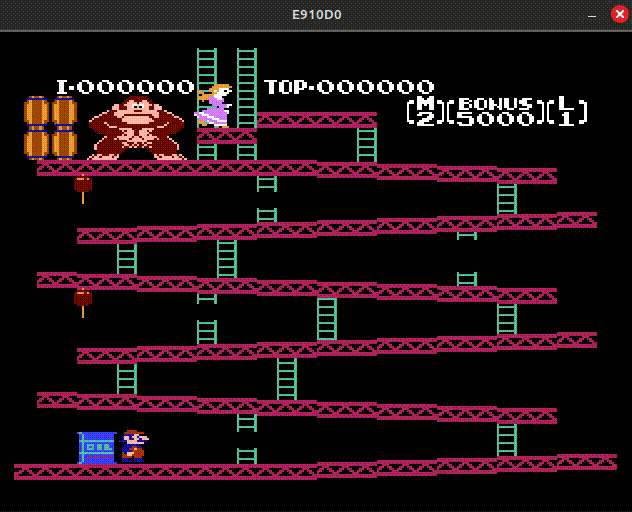

### Commands:

<table>
    <tr> <th> Keyboard Controls </th> <th> NES Equivalent / Gamepad Buttons </th> </tr>
    <tr> <td> W/A/S/D </td> <td> D-PAD </td> <tr>
    <tr> <td> SPACE </td> <td> SELECT </td> <tr>
    <tr> <td> ENTER </td> <td> START </td> <tr>
    <tr> <td> [ </td> <td> A-BUTTON / Y-BUTTON </td> <tr>
    <tr> <td> ] </td> <td> B-BUTTON </td> <tr>
</table>

<table>
    <tr> <th> Keyboard Controls </th> <th> NES Commands </th> </tr>
    <tr> <td> ESCAPE </td> <td> EXIT </td> <tr/>
    <td> NUM_6 </td> <td> PAUSE / UNPAUSE (Continuous execute) </td> <tr>
    <tr> <td> NUM_7 </td> <td> STEP (Stepwise Execute) </td> <tr>
    <tr> <td> NUM_8 </td> <td> IRQ (Interrupt Request) </td> <tr>
    <tr> <td> NUM_9 </td> <td> NMI (Non-Maskable Interrupt) </td> <tr>
    <tr> <td> NUM_0 </td> <td> RST (Reset) </td> <tr>
</table>

### Tests:
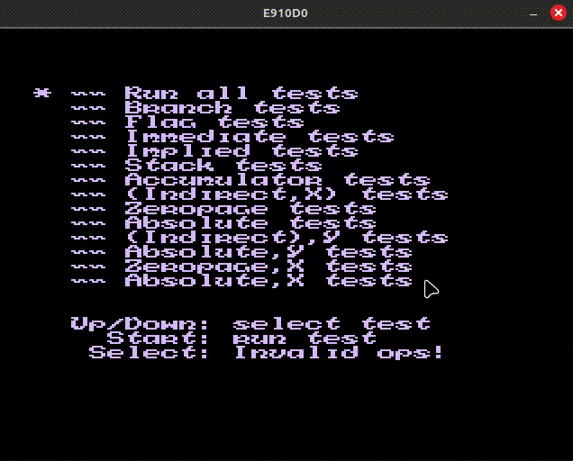
- Passes all official tests in video mode at reset vector: 0xC004.
- Matches first 5000 lines of nestest.log (upto official instruction tests) in automation mode with PC force-set at 0xC000.
- CPU tests for every 6502 instruction are available in `tests/e910D0Tests.cpp`.
- Replace the file with `e910D0.cpp` to run test suite.

### Tested NES Games:
- Mapper 0 (Donkey Kong, Ice Climber, Super Mario Bros. 1, Excite Bike, Kung Fu)

<table>
    <tr>
        <td> 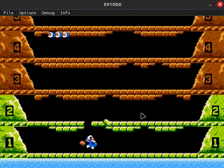 </td>
        <td> 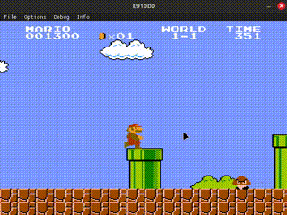 </td>
    <tr>
</table>

- Mapper 1 (Metroid, The Legend of Zelda, Megaman 2, Snow Bros.) [MMC1 - ASIC]

<table>
    <tr>
        <td> 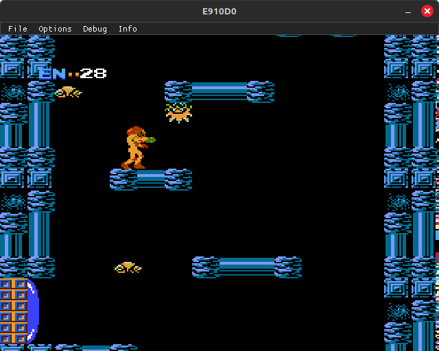 </td>
        <td> 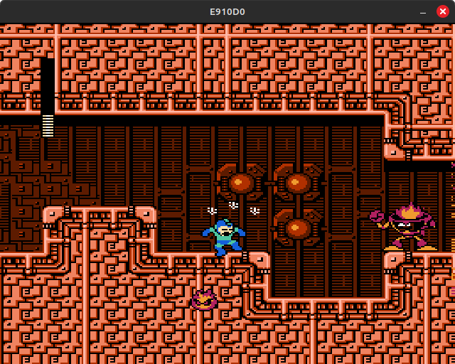 </td>
    <tr>
    <tr>
        <td> 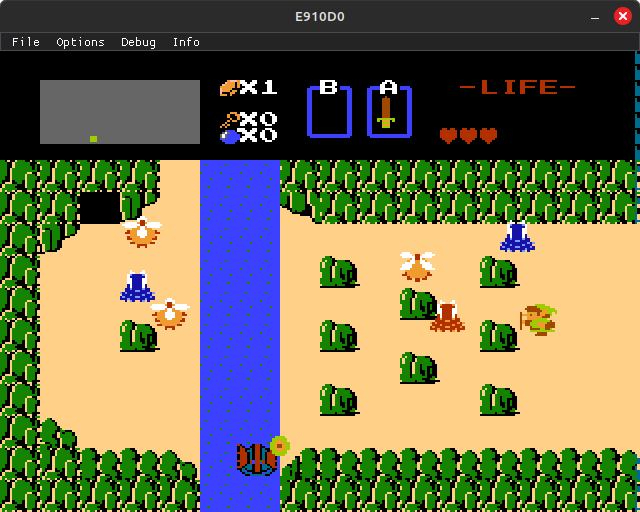 </td>
        <td> 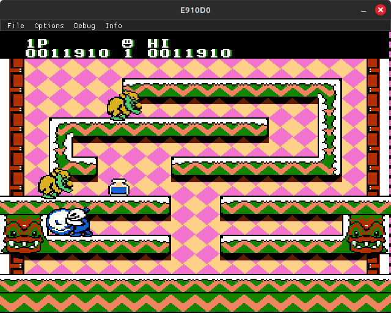 </td>
    <tr>
</table>

- Mapper 2 (Megaman, Castlevania, Contra, Metal Gear)

<table>
    <tr>
        <td> 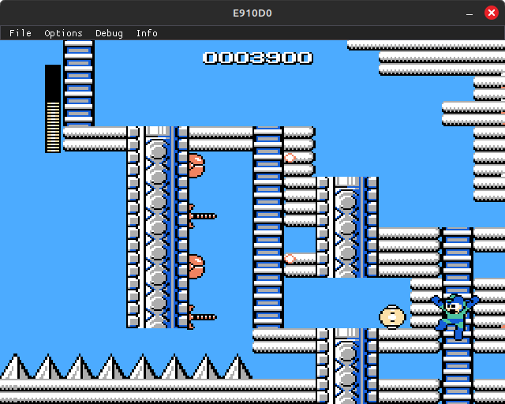 </td>
        <td> 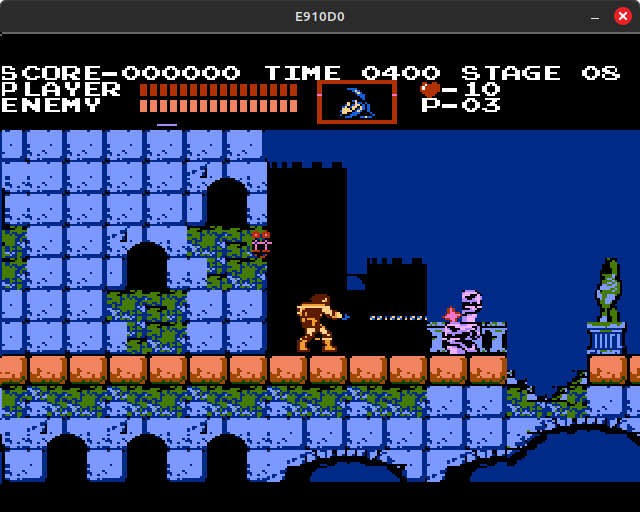 </td>
    <tr>
    <tr>
        <td> 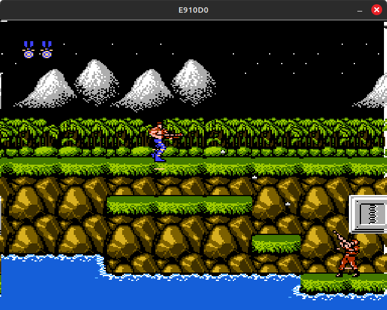 </td>
        <td> 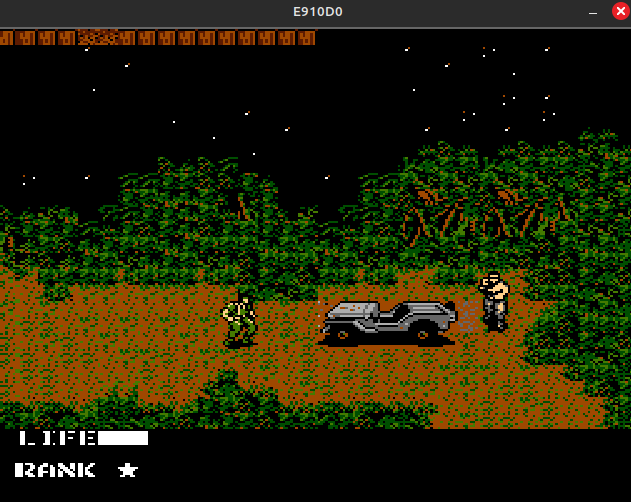 </td>
    <tr>
</table>

- Mapper 3 (Milon's Secret Castle, Adventure Island, Track & Field, Tengen's Tetris)

<table>
    <tr>
        <td> 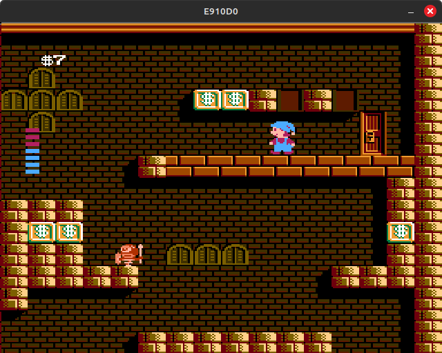 </td>
        <td> 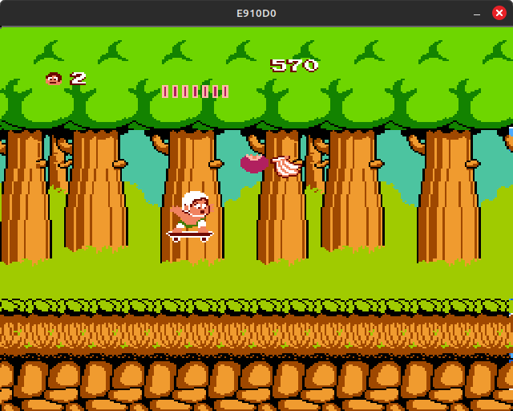 </td>
    <tr>
        <td> 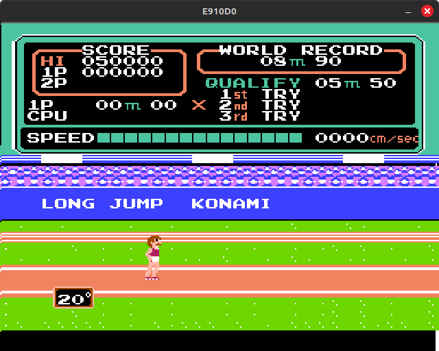 </td>
        <td> 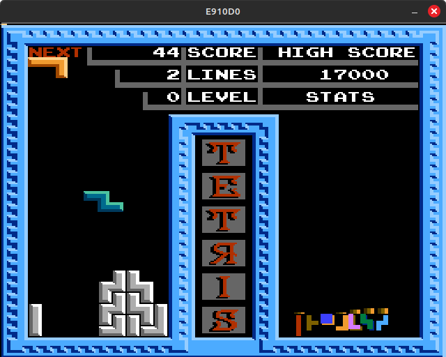 </td>
    <tr>
</table>

