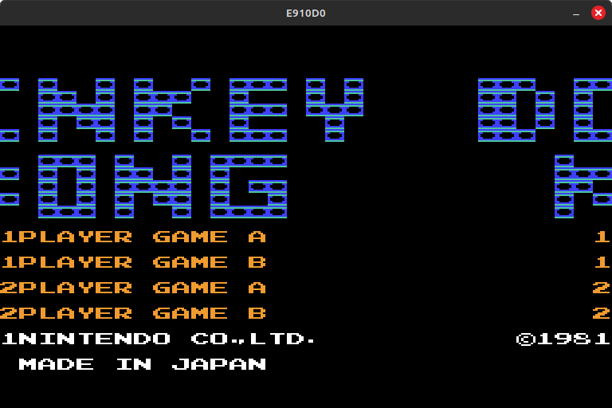
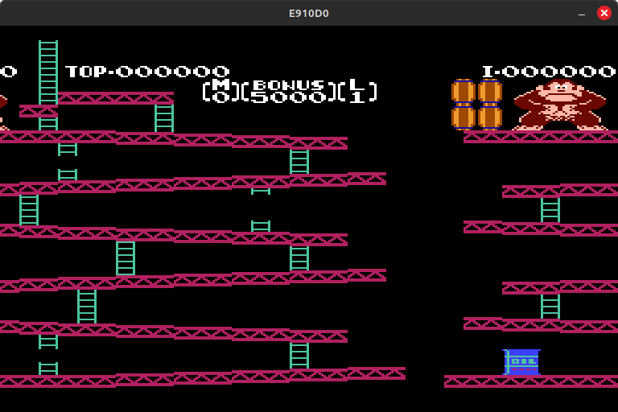
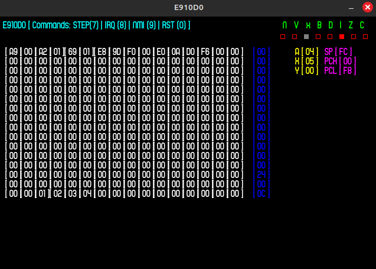
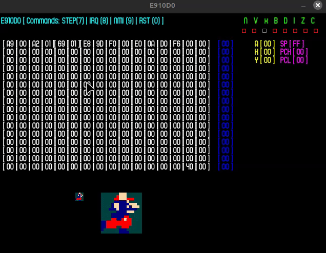

# E910D0 v1.0 [NES Emulator]
- Author: Diwas Adhikari
- Status: In Progress
- Description: NES Emulator to relive my childhood memories of playing with a bootleg NES console 
             which looked like a PS1 and had a vertical cartridge slot like a SNES :)
- Comments: This started up as being rigidly behavior-driven but, I kept on removing unnecessary
          junk to speed up and keep stuff clean. The goal itself is to make NES games playable.

## Current Status:
- Donkey Kong Title Screen

- Donkey Kong Game Screen

## 6502 CPU GUI [Only relevant for CPU testing phase]:

### Tests:
- CPU tests for every 6502 instruction are available in `tests/e910D0Tests.cpp`.
- Replace the file with `e910D0.cpp` to run test suite.

### Commands:
- NUM_6 -> PAUSE / UNPAUSE (Continuous execute)
- NUM_7 -> STEP (Stepwise Execute)
- NUM_8 -> IRQ (Interrupt Request)
- NUM_9 -> NMI (Non-Maskable Interrupt)
- NUM_0 -> RST (Reset)

### Legend:
- White block (Zero page memory block <$0x0000 - $0x00FF>)
- Blue block (Bottom stack <$0x01F0 - $0x01FF>)
- Top right block 
( Status Flags | Yellow block - General Purpose Registers | Magenta block - Special Purpose Registers)

[The sprite is directly loaded from CHR-ROM data just to make sure I see Mario !] 

